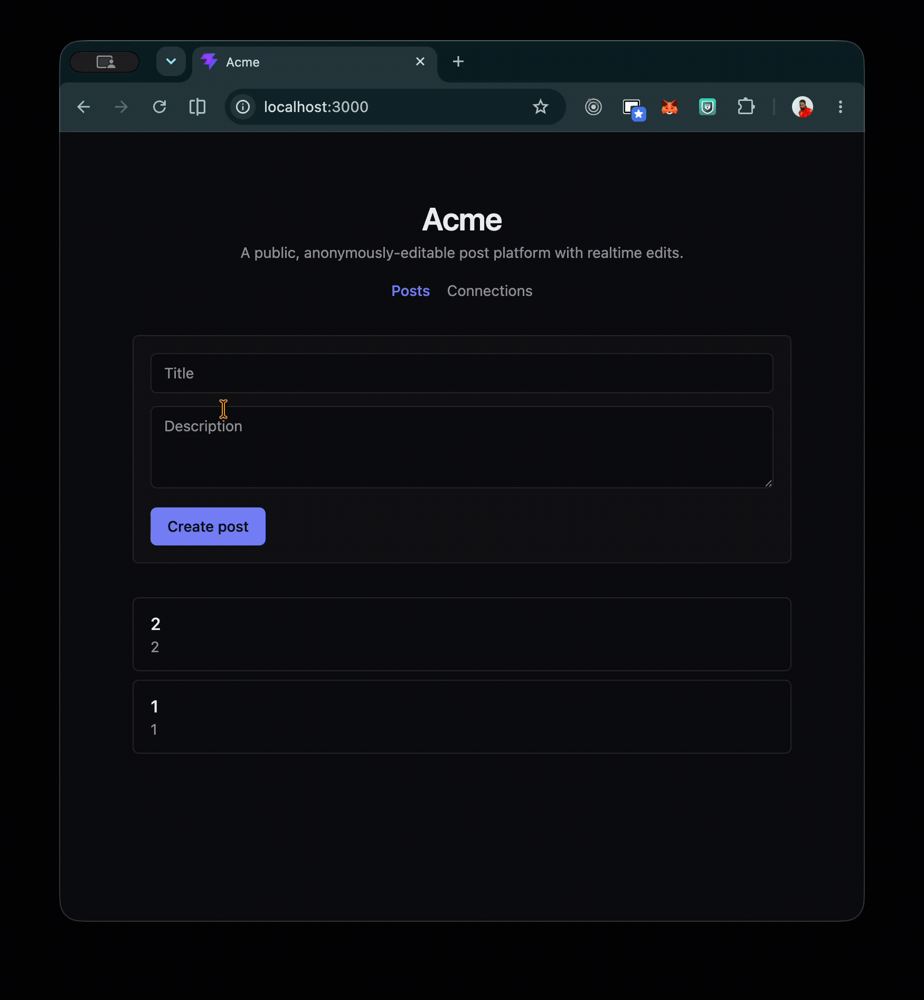
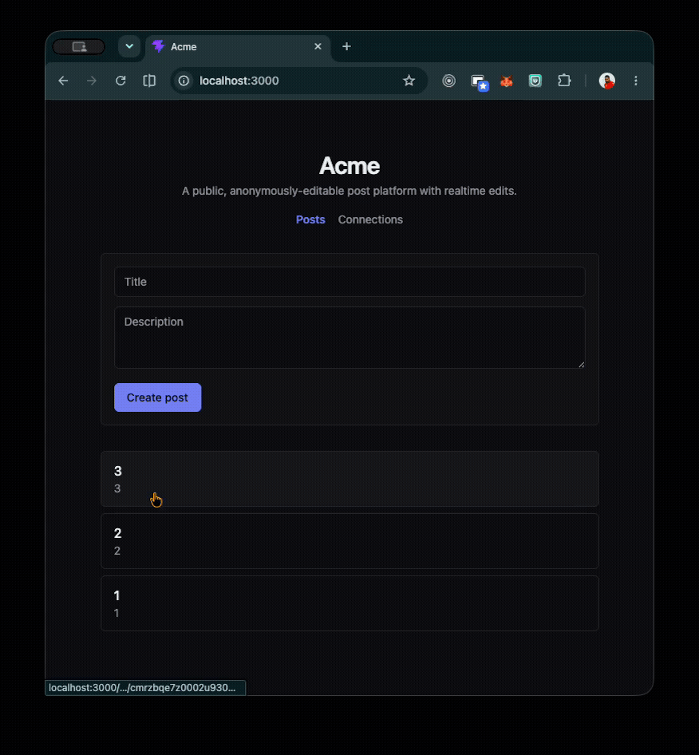
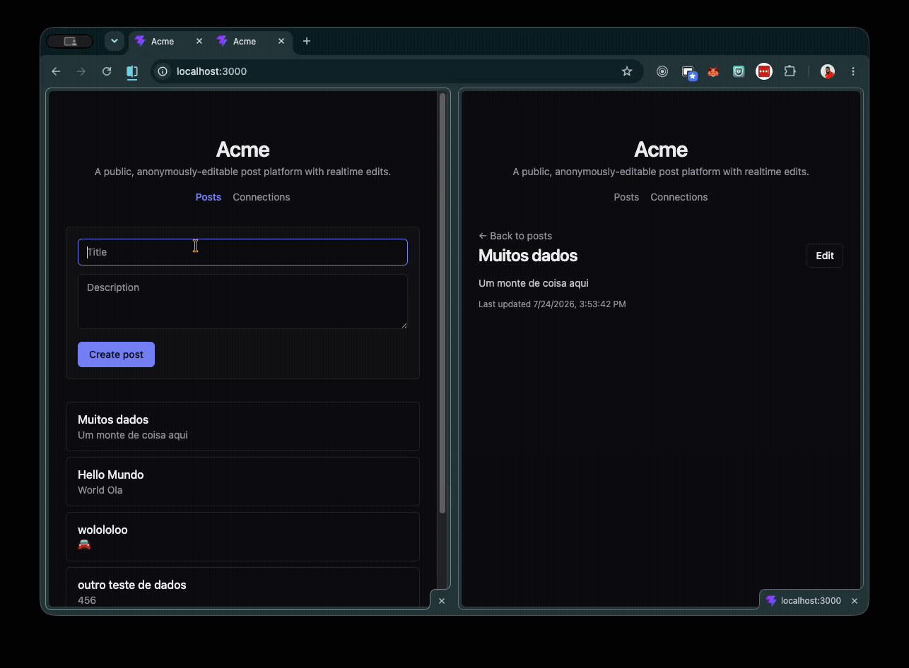
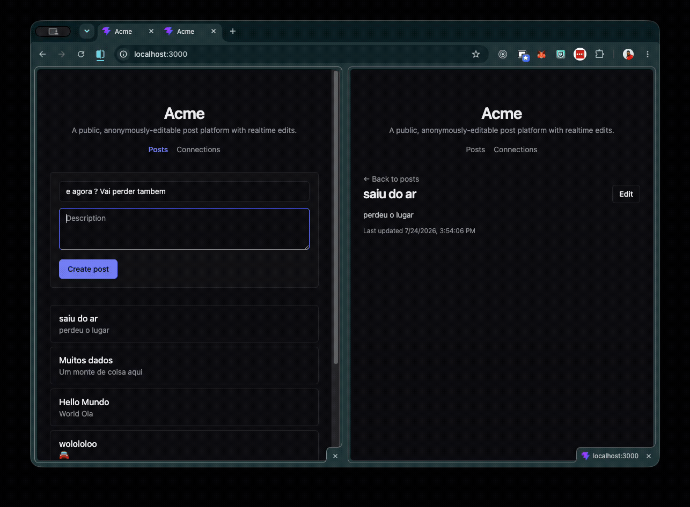

# Relatório Técnico ⥋ Correção de Bugs · Acme (CapLink Technical Test)

**Tabela de Revisão**

| Item                     | Detalhe                          |
| ------------------------ | -------------------------------- |
| **Data da revisão**      | 24 de julho de 2026              |
| **Versão do relatório**  | v1.1                             |
| **Analista responsável** | Yuri Farias                      |
| **Status da correção**   | Concluído                        |
| **Bugs corrigidos**      | 10 (+ 1 melhoria de resiliência) |
| **Testes**               | 9/9 aprovados                    |
| **Build**                | Limpo (backend + frontend)       |
| **Lint**                 | Limpo                            |

> **Changelog v1.1** ⥋ adicionados dois bugs encontrados em uso após a auditoria inicial: [5.3](#53-postslistpage--lista-reordena-ao-dar-refresh) (lista reordena ao dar refresh) e [5.4](#54-postslistpage--lista-desatualizada-ao-voltar-da-edição) (lista desatualizada ao voltar da edição).

---

> Auditoria e correção de bugs semeados em um monorepo full-stack (React 19 + Node/TypeScript, GraphQL, RabbitMQ, Prisma, TSyringe), seguindo Clean Architecture/DDD.

**Resultado final:** `9/9` testes passando · `lint` limpo · `build` limpo (backend `tsc` + frontend `tsc -b && vite build`).

---

## Sumário

- [1. Metodologia](#1-metodologia)
- [2. Panorama dos bugs](#2-panorama-dos-bugs)
- [3. Bugs cobertos por teste (backend)](#3-bugs-cobertos-por-teste-backend)
  - [3.1 `PostMapper.toPersistenceUpdate` ⥋ campo `title` omitido](#31-postmappertopersistenceupdate--campo-title-omitido)
  - [3.2 `EditPostUseCase` ⥋ publica evento antes de persistir](#32-editpostusecase--publica-evento-antes-de-persistir)
  - [3.3 `resolveEventTopic` ⥋ mapeamento de tópicos invertido](#33-resolveeventtopic--mapeamento-de-tópicos-invertido)
  - [3.4 `getPostEventsQueueOptions` ⥋ fila compartilhada quebra o fan-out](#34-getposteventsqueueoptions--fila-compartilhada-quebra-o-fan-out)
  - [3.5 `registerConnectionsDomain` ⥋ registry transient em vez de singleton](#35-registerconnectionsdomain--registry-transient-em-vez-de-singleton)
- [4. Melhoria de resiliência (backend)](#4-melhoria-de-resiliência-backend)
  - [4.1 `POST_EVENTS_PRODUCER` ⥋ conexão AMQP por requisição](#41-post_events_producer--conexão-amqp-por-requisição)
- [5. Bugs de runtime (frontend)](#5-bugs-de-runtime-frontend)
  - [5.1 `PostsListPage` ⥋ post duplicado com id falso](#51-postslistpage--post-duplicado-com-id-falso)
  - [5.2 `PostDetailPage` ⥋ formulário de edição vazio](#52-postdetailpage--formulário-de-edição-vazio)
  - [5.3 `PostsListPage` ⥋ lista reordena ao dar refresh](#53-postslistpage--lista-reordena-ao-dar-refresh)
  - [5.4 `PostsListPage` ⥋ lista desatualizada ao voltar da edição](#54-postslistpage--lista-desatualizada-ao-voltar-da-edição)
- [6. O que NÃO era bug (distrator)](#6-o-que-não-era-bug-distrator)
- [7. Verificação](#7-verificação)
- [8. Como evitar estes bugs ⥋ playbook de prevenção](#8-como-evitar-estes-bugs--playbook-de-prevenção)
  - [8.1 Consistência em arquitetura orientada a eventos](#81-consistência-em-arquitetura-orientada-a-eventos)
  - [8.2 Topologia de mensageria (RabbitMQ)](#82-topologia-de-mensageria-rabbitmq)
  - [8.3 Ciclo de vida na injeção de dependência](#83-ciclo-de-vida-na-injeção-de-dependência)
  - [8.4 Mapeamento de domínio ↔ persistência](#84-mapeamento-de-domínio--persistência)
  - [8.5 Cache e estado no frontend (Apollo + React)](#85-cache-e-estado-no-frontend-apollo--react)
  - [8.6 Checklist de code review](#86-checklist-de-code-review)
  - [8.7 Trade-off de arquitetura: persist-then-publish vs. Transactional Outbox](#87-trade-off-de-arquitetura-persist-then-publish-vs-transactional-outbox)
- [9. Material complementar para treinamento](#9-material-complementar-para-treinamento)
  - [9.1 Leituras canônicas por tema](#91-leituras-canônicas-por-tema)
  - [9.2 Ferramentas e guardrails automáticos](#92-ferramentas-e-guardrails-automáticos)
- [10. Conclusão](#10-conclusão)

---

## 1. Metodologia

A investigação seguiu três princípios, na ordem abaixo:

1. **Sinal objetivo primeiro.** Rodei `npm test` antes de qualquer leitura. O Vitest apontou **6 testes falhando em 5 arquivos**, o que deu um mapa direto dos bugs com cobertura automatizada.
2. **Diagnóstico sistemático por camada.** Li todos os arquivos do backend camada por camada (Domain → Use Cases → Mappers → Repositories → DI → Eventos/RabbitMQ → GraphQL) e depois o frontend (Apollo Client → GraphQL docs → páginas). Isso expõe bugs que **não** têm teste ⥋ os que só aparecem usando a aplicação.
3. **Correção na causa raiz, nunca na asserção.** Todos os testes ficaram verdes corrigindo o **código de produção**, sem afrouxar nenhum `expect`. A regra do desafio (`README`) é clara: os testes são o sinal, não o alvo.
   > **Premissa importante:** o enunciado avisa que não há "um bug por arquivo" nem distribuição uniforme. Por isso a leitura foi exaustiva mesmo nos arquivos cujo teste já passava ⥋ foi assim que os bugs de frontend (sem test runner) e a melhoria de DI do producer apareceram.

Saída inicial do `npm test`:

```
Test Files  5 failed | 1 passed (6)
     Tests  6 failed | 3 passed (9)
```

---

## 2. Panorama dos bugs

| #   | Camada               | Arquivo                                        | Sintoma                                            | Sinal    |
| --- | -------------------- | ---------------------------------------------- | -------------------------------------------------- | -------- |
| 1   | Domain / Mapper      | `posts/mappers/PostMapper.ts`                  | Edição de **título** nunca persiste                | teste    |
| 2   | Use Case             | `posts/use-cases/EditPostUseCase.ts`           | Evento publicado antes da escrita (inconsistência) | teste    |
| 3   | Eventos / RabbitMQ   | `posts/consumers/resolveEventTopic.ts`         | Create dispara subscription de Edit e vice-versa   | teste    |
| 4   | Eventos / RabbitMQ   | `posts/consumers/getPostEventsQueueOptions.ts` | Realtime só chega a **uma** réplica                | teste    |
| 5   | Dependency Injection | `connections/index.ts`                         | Dashboard lê registry vazio (2 instâncias)         | teste    |
| 6   | Dependency Injection | `posts/index.ts`                               | Nova conexão AMQP por mutation (leak)              | melhoria |
| 7   | Frontend / Cache     | `frontend/pages/PostsListPage.tsx`             | Post aparece duplicado e link quebra (404)         | runtime  |
| 8   | Frontend / UI        | `frontend/pages/PostDetailPage.tsx`            | Formulário de edição abre vazio                    | runtime  |
| 9   | Frontend / Backend   | `posts/repositories/PrismaPostRepository.ts`   | Lista troca de posição ao dar refresh              | runtime  |
| 10  | Frontend / Cache     | `frontend/pages/PostsListPage.tsx`             | Lista fica desatualizada ao voltar da edição       | runtime  |

Sinal: `teste` = coberto por teste automatizado; `melhoria` = melhoria de resiliência (sem teste); `runtime` = só verificável executando o app.

> Os bugs **9** e **10** foram encontrados em uso, depois da auditoria guiada por testes ⥋ exatamente a classe que o `README` avisa não ter cobertura automática. Detalhados em [5.3](#53-postslistpage--lista-reordena-ao-dar-refresh) e [5.4](#54-postslistpage--lista-desatualizada-ao-voltar-da-edição).

---

## 3. Bugs cobertos por teste (backend)

### 3.1 `PostMapper.toPersistenceUpdate` ⥋ campo `title` omitido

**Localização:** `backend/src/domains/posts/mappers/PostMapper.ts` (~linha 25)

**Como encontrei:** teste `PostMapper.test.ts > includes every editable field in the Prisma update input` falhava com `expected undefined to be 'New title'`.

**Sintoma / Impacto:** ao editar um post, **o título nunca era gravado no PostgreSQL**. A mutation retornava sucesso, o realtime propagava a descrição nova, mas o título voltava ao valor antigo em qualquer refresh. Bug silencioso e insidioso ⥋ passa despercebido em uma demo rápida.

**Causa raiz:** o objeto `Prisma.PostUpdateInput` montado pelo mapper simplesmente não incluía `title`. Como `PrismaPostRepository.update()` delega 100% da montagem ao mapper, o campo nunca chegava ao `UPDATE`.

**Correção:**

```diff
  static toPersistenceUpdate(post: Post): Prisma.PostUpdateInput {
    return {
+     title: post.title,
      description: post.description,
      updatedAt: post.updatedAt,
    }
  }
```

---

### 3.2 `EditPostUseCase` ⥋ publica evento antes de persistir

**Localização:** `backend/src/domains/posts/use-cases/EditPostUseCase.ts` (~linhas 20-24)

**Como encontrei:** teste `EditPostUseCase.test.ts > persists the update before publishing the PostEdited event` ⥋ esperava a ordem `['update', 'publish']` e recebia `['publish', 'update']`.

**Sintoma / Impacto:** violação de consistência em arquitetura orientada a eventos. Se a escrita no banco falhar **depois** do evento ter sido publicado, todos os assinantes conectados recebem uma edição que **nunca foi persistida** ⥋ a UI de outras abas passa a mostrar um estado que não existe no banco. É o clássico problema de "publicar fato antes de ele ser verdade".

**Causa raiz:** a ordem das duas `await`s estava trocada. O correto é **persistir e só então publicar** a entidade já confirmada (`updated`), nunca a instância em memória (`post`) antes da confirmação.

**Correção:**

```diff
  post.edit(input.title, input.description)

- await this.producer.publishPostEdited(post)
- const updated = await this.repo.update(post)
+ const updated = await this.repo.update(post)
+ await this.producer.publishPostEdited(updated)

  return updated
```

---

### 3.3 `resolveEventTopic` ⥋ mapeamento de tópicos invertido

**Localização:** `backend/src/domains/posts/consumers/resolveEventTopic.ts` (~linhas 5-7)

**Como encontrei:** dois testes em `resolveEventTopic.test.ts` ⥋ `'PostCreated'` retornava `'POST_EDITED'` e `'PostEdited'` retornava `'POST_CREATED'`.

**Sintoma / Impacto:** o consumidor RabbitMQ usa essa função para decidir em qual tópico do GraphQL PubSub republicar cada evento. Com o mapeamento invertido:

- um post **criado** era publicado no tópico `POST_EDITED` → disparava a subscription `postEdited` (não a `postCreated`), então **posts novos não apareciam** na lista;
- um post **editado** ia para `POST_CREATED` → disparava `postCreated`, então **edições não atualizavam** o item.
  **Causa raiz:** os dois ramos do `if` estavam com os valores de retorno trocados.

**Correção:**

```diff
  export function resolveEventTopic(eventType: PostEventType): PostEventTopic {
-   if (eventType === 'PostCreated') return 'POST_EDITED'
-   return 'POST_CREATED'
+   if (eventType === 'PostCreated') return 'POST_CREATED'
+   return 'POST_EDITED'
  }
```

---

### 3.4 `getPostEventsQueueOptions` ⥋ fila compartilhada quebra o fan-out

**Localização:** `backend/src/domains/posts/consumers/getPostEventsQueueOptions.ts` (~linha 10)

**Como encontrei:** teste `getPostEventsQueueOptions.test.ts` esperava `name === ''`, `exclusive === true`, `autoDelete === true`; recebia `'posts-events-queue'`, `false`, `false`.

**Sintoma / Impacto:** este é o bug mais "arquitetural" do conjunto. O sistema usa um **exchange do tipo `fanout`** para espalhar cada evento por **todas as réplicas** do backend ⥋ cada réplica mantém suas próprias conexões WebSocket, então todas precisam receber uma cópia de todo evento.

Com uma fila **nomeada e compartilhada** (`posts-events-queue`, não exclusiva, não auto-delete), várias réplicas declaram e consomem a **mesma** fila. O RabbitMQ então faz **round-robin**: cada evento vai para **apenas uma** réplica. Resultado: clientes conectados às outras réplicas **nunca recebem o update em tempo real**. Em `docker-compose` com 1 réplica o bug fica escondido; com 2+ réplicas ele se manifesta.

**Causa raiz:** para fan-out por réplica, cada instância precisa de uma fila **própria e efêmera**. A convenção AMQP para isso é uma fila **anônima** (`name: ''`, o broker gera um nome único), **exclusiva** (só aquela conexão a usa) e **auto-delete** (some quando a réplica cai).

**Correção:**

```diff
- return { name: 'posts-events-queue', exclusive: false, autoDelete: false }
+ return { name: '', exclusive: true, autoDelete: true }
```

> **Por que funciona:** com fila anônima+exclusiva+auto-delete, cada réplica tem sua própria fila ligada ao exchange `fanout`. O broker entrega uma cópia de cada mensagem para **cada** fila → **cada** réplica → **cada** cliente conectado.

---

### 3.5 `registerConnectionsDomain` ⥋ registry transient em vez de singleton

**Localização:** `backend/src/domains/connections/index.ts` (~linha 6)

**Como encontrei:** teste `connections/index.test.ts > registers a single shared connection registry instance` ⥋ resolvia o token duas vezes e esperava `first === second`; recebia instâncias distintas ("serializes to the same string").

**Sintoma / Impacto:** no TSyringe, `container.register(token, { useClass })` registra o provider como **transient por padrão** ⥋ cada `resolve` devolve uma **instância nova**. O `ConnectionTrackingService` (resolvido uma vez no boot) escreve as conexões numa instância do registry; o `GetConnectionsSnapshotUseCase` (resolvido por requisição no resolver de query) lê de **outra** instância, sempre vazia. Efeito: **o dashboard de conexões reporta contagem errada** (a query lê um registry que ninguém alimenta).

**Causa raiz:** faltou declarar o ciclo de vida `Singleton` para o token do registry, que por natureza precisa ser um estado único e compartilhado no processo.

**Correção:**

```diff
  import type { DependencyContainer } from 'tsyringe'
+ import { Lifecycle } from 'tsyringe'
  import { CONNECTION_REGISTRY } from './core/ports/IConnectionRegistry.js'
  import { InMemoryConnectionRegistry } from './repositories/InMemoryConnectionRegistry.js'

  export function registerConnectionsDomain(container: DependencyContainer): void {
-   container.register(CONNECTION_REGISTRY, { useClass: InMemoryConnectionRegistry })
+   container.register(
+     CONNECTION_REGISTRY,
+     { useClass: InMemoryConnectionRegistry },
+     { lifecycle: Lifecycle.Singleton },
+   )
  }
```

---

## 4. Melhoria de resiliência (backend)

### 4.1 `POST_EVENTS_PRODUCER` ⥋ conexão AMQP por requisição

**Localização:** `backend/src/domains/posts/index.ts` (~linha 11)

**Como encontrei:** não há teste para isto ⥋ apareceu na leitura por camada, logo após corrigir o bug 3.5. O mesmo raciocínio de ciclo de vida (transient × singleton) se aplica aqui, e o enunciado pede atenção explícita a "instâncias como singleton vs transient".

**Sintoma / Impacto:** `useFactory` no TSyringe também é **transient** ⥋ a factory roda a cada `resolve`. Como o `PostEventsProducer` é injetado nos use cases (resolvidos por requisição), **cada `createPost`/`editPost` abre uma nova conexão AMQP** e abandona a anterior. Sob carga isso vira um vazamento de conexões/canais contra o RabbitMQ.

**Causa raiz:** faltou cachear a instância do producer. O TSyringe oferece o helper `instanceCachingFactory` exatamente para singletons construídos via factory.

**Correção:**

```diff
  import type { DependencyContainer } from 'tsyringe'
+ import { instanceCachingFactory } from 'tsyringe'
  ...
  container.register(POST_EVENTS_PRODUCER, {
-   useFactory: () => new PostEventsProducer(process.env.RABBITMQ_URL!),
+   useFactory: instanceCachingFactory(
+     () => new PostEventsProducer(process.env.RABBITMQ_URL!),
+   ),
  })
```

> Não é necessário para deixar os testes verdes, mas é o comportamento correto de produção: uma única conexão/canal de longa duração, reaproveitada por todas as mutations.

---

## 5. Bugs de runtime (frontend)

> Não há test runner no frontend (conforme `README`), então estes bugs foram encontrados por leitura crítica das páginas + raciocínio sobre o fluxo Apollo Client / cache / subscriptions.

### 5.1 `PostsListPage` ⥋ post duplicado com id falso

**Localização:** `frontend/src/pages/PostsListPage.tsx` (handler `onSubmit` do formulário)

**Como encontrei:** ao ler o `onSubmit`, notei que ele inseria no cache um item com **`crypto.randomUUID()`** como `id`, enquanto a subscription `postCreated` logo abaixo tinha um guard de deduplicação que compara pelo `id` **real** do backend.

**Sintoma / Impacto:** o id gerado no cliente **nunca** coincide com o `cuid` que o backend atribui. Quando o evento `postCreated` chega (a subscription entrega para todas as abas, inclusive a do autor), o guard `posts.some(p => p.id === post.id)` não encontra o item falso e **insere o post de novo** → o autor vê o **post duplicado**. Pior: o item falso aponta para `/posts/<uuid-falso>`, que resulta em **404** ("Post not found").

**Causa raiz:** inserção otimista com identidade inventada em vez de usar a identidade real retornada pela mutation. A normalização do Apollo é por `__typename:id` ⥋ usar um id fantasma sabota tanto a deduplicação quanto o roteamento.

**Correção:** aguardar a mutation e inserir o post **real** retornado, reaproveitando o guard de deduplicação:

```diff
- onSubmit={(event) => {
+ onSubmit={async (event) => {
    event.preventDefault()
    if (!title.trim() || !description.trim()) return
-   createPost({ variables: { input: { title, description } } })
-   const now = new Date().toISOString()
-   updateQuery((prev) => ({
-     posts: [
-       { id: crypto.randomUUID(), title, description, createdAt: now, updatedAt: now },
-       ...prev.posts,
-     ],
-   }))
+   const { data: created } = await createPost({
+     variables: { input: { title, description } },
+   })
+   const post = created?.createPost as Post | undefined
+   if (post) {
+     // Usa o id REAL do backend, para o guard da subscription deduplicar
+     // e o autor nunca ver o post duas vezes.
+     updateQuery((prev) =>
+       prev.posts.some((existing) => existing.id === post.id)
+         ? prev
+         : { posts: [post, ...prev.posts] },
+     )
+   }
    setTitle('')
    setDescription('')
  }}
```

---

### 5.2 `PostDetailPage` ⥋ formulário de edição vazio

**Localização:** `frontend/src/pages/PostDetailPage.tsx` (`useEffect` de seed + botão "Edit")

**Como encontrei:** o `useEffect` de seed do formulário tinha array de dependências **vazio** (`[]`) com um `eslint-disable`, e a query roda em modo assíncrono (`loading`).

**Sintoma / Impacto:** no mount, `data?.post` ainda é `undefined` (query em `loading`). O efeito roda **uma vez** com `[]`, não faz nada, e **nunca re-executa** quando os dados chegam. Ao clicar em "Edit", o formulário abre com `title`/`description` **vazios**. Se o usuário salvar sem redigitar, a mutation envia strings vazias e bate na validação `@IsNotEmpty()` do backend ⥋ edição falha silenciosamente (sem tratamento de erro na UI).

**Causa raiz:** dependência de um efeito de mount para semear estado que só existe **após** o carregamento assíncrono. Trocar as deps para `[data?.post]` "resolveria" o vazio, mas introduziria outro bug: uma edição em tempo real vinda de outra aba re-dispararia o efeito e **sobrescreveria o que o usuário está digitando**.

**Correção:** eliminar o efeito frágil e semear o formulário **no momento de entrar em modo de edição** ⥋ valores sempre frescos, e imunes a updates de realtime durante a digitação:

```diff
- import { useEffect, useState } from 'react'
+ import { useState } from 'react'
  ...
-  // Seed the form once from the post that was loaded when this page mounted.
-  useEffect(() => {
-    if (data?.post) {
-      setTitle(data.post.title)
-      setDescription(data.post.description)
-    }
-    // eslint-disable-next-line react-hooks/exhaustive-deps
-  }, [])
  ...
      <button
        type="button"
-       onClick={() => setIsEditing(true)}
+       onClick={() => {
+         setTitle(post.title)
+         setDescription(post.description)
+         setIsEditing(true)
+       }}
      >
        Edit
      </button>
```

---

### 5.3 `PostsListPage` ⥋ lista reordena ao dar refresh

**Localização:** `backend/src/domains/posts/repositories/PrismaPostRepository.ts` (`findAll`) ⥋ sintoma observado no frontend.

**Como encontrei:** usando o app. Ao criar um post ele aparece no topo da lista; ao dar refresh, ele "pula" para o fim. Nenhum teste cobre ordenação.

**Sintoma / Impacto:** a ordem que o usuário vê ao vivo contradiz a ordem após recarregar ⥋ os posts trocam de posição no refresh, o que parece bug de dados e mina a confiança na UI.



**Causa raiz:** um **contrato de ordenação divergente** entre as duas pontas. O frontend insere posts novos com `[post, ...prev.posts]` (prepend → **mais novo no topo**), tanto no handler de criação quanto na subscription `postCreated`. Já o backend retornava a lista com `orderBy: { createdAt: 'asc' }` (**mais novo no fim**). Ao vivo prevalece o prepend; no refresh prevalece a query ⥋ daí a troca de posição.

**Correção:** alinhar a ordem canônica do servidor à intenção do cliente (feed mais-novo-primeiro):

```diff
- const rows = await this.prisma.post.findMany({ orderBy: { createdAt: 'asc' } })
+ const rows = await this.prisma.post.findMany({ orderBy: { createdAt: 'desc' } })
```

> Optei por `createdAt: 'desc'` (e não `updatedAt`) justamente para casar com o prepend por criação ⥋ assim editar um post **não** o faz saltar de posição. Um feed "por atividade recente" usaria `updatedAt: 'desc'`, mas seria outra UX.



---

### 5.4 `PostsListPage` ⥋ lista desatualizada ao voltar da edição

**Localização:** `frontend/src/pages/PostsListPage.tsx` (`useEffect` + `refetch`) e `frontend/src/App.tsx` (subscription `postCreated` para updates ao vivo).

**Como encontrei:** usando o app com o fluxo real ⥋ enquanto uma sessão está num post (lendo/editando), **posts criados por outras pessoas não aparecem** ao voltar para a lista, só após um refresh manual.

**Sintoma / Impacto:** a lista de uma sessão fica "presa no passado" durante toda a permanência na tela de detalhe. Como o roteamento (`App.tsx`) coloca lista e detalhe em rotas separadas (`/` vs `/posts/:id`), abrir um post **desmonta** a `PostsListPage` e derruba sua subscription `postCreated` ⥋ nada na sessão escuta novos posts enquanto se está no detalhe.



**Causa raiz:** abrir um post desmonta a `PostsListPage`, e ao voltar o `useQuery(POSTS_QUERY)` em `cache-first` (padrão) devolve a lista que está em cache sem ir à rede ⥋ os posts criados durante a ausência não estão nesse cache. Depender da entrega em tempo real (subscription) para manter o cache vivo se mostrou frágil no ambiente de execução.

**Correção (adotada):** um `useEffect` que chama `refetch()` no mount da `PostsListPage`. Como a página remonta ao voltar de `/posts/:id`, busco a lista atual do servidor toda vez ⥋ os posts criados durante a ausência aparecem, sem depender de subscription nem de política de cache:

```diff
+ import { useEffect, useState } from 'react'
  ...
+ const { data, loading, error, refetch, updateQuery } = useQuery<{ posts: Post[] }>(POSTS_QUERY)
+
+ useEffect(() => {
+   void refetch()
+ }, [refetch])
```



Para as atualizações ao vivo enquanto a lista está na tela (duas abas abertas), mantenho a subscription `postCreated` no `App`, acima do roteador, escrevendo no cache do `POSTS_QUERY`. A divisão de responsabilidades fica clara: a subscription cobre o cenário "ao vivo na tela", e o `refetch` no mount cobre o cenário "voltei para a lista".

> **Nota de honestidade:** tentei antes `cache-and-network` e, em seguida, a subscription no nível do `App`; ambas dependiam do timing de remontagem ou da entrega em tempo real chegar ao client, e não resolveram no ambiente real. O `refetch` explícito no mount é determinístico: pergunta ao servidor toda vez que a lista aparece.

---

## 6. O que NÃO era bug (distrator)

`frontend/src/lib/apollo.ts` **já estava correto**. O `split` do Apollo Client roteia corretamente:

- **Subscriptions** → `GraphQLWsLink` (WebSocket, `ws://localhost:8000/graphql`);
- **Queries/Mutations** → `HttpLink` (HTTP, `http://localhost:8000/graphql`).
  Diferenciar o que está certo do que apenas _parece_ suspeito é parte do trabalho ⥋ mexer aqui teria quebrado o transporte de realtime. Registrado para transparência da auditoria.

---

## 7. Verificação

Todas as verificações do `README` passam após as correções:

| Comando                                          | Antes                   | Depois                      |
| ------------------------------------------------ | ----------------------- | --------------------------- |
| `npm test` (Vitest, backend)                     | 6 falhando / 3 passando | **9 passando / 0 falhando** |
| `npm run lint` (backend + frontend)              | limpo                   | **limpo**                   |
| `npm run build` (`tsc` + `tsc -b && vite build`) | limpo                   | **limpo**                   |

```
 Test Files  6 passed (6)
      Tests  9 passed (9)
```

**Roteiro de validação manual (frontend, sem test runner):**

1. Abrir duas abas em `http://localhost:3000`.
2. **Criar** um post em uma aba → deve aparecer **uma única vez** em ambas (valida 5.1 e o fan-out 3.4/3.3).
3. **Editar** o título de um post → deve refletir em tempo real nas duas abas **e** persistir após refresh (valida 3.1, 3.2, 3.3 e 5.2).
4. Abrir o **Connections dashboard** → a contagem deve subir/descer conforme abas conectam/desconectam (valida 3.5).
5. **Dar refresh** com vários posts → a ordem deve permanecer a mesma (mais novo no topo), sem trocar de posição (valida 5.3).
6. Numa aba, **abrir um post**; em outra, **criar** posts; voltar para a lista na primeira aba → os posts novos devem aparecer sem refresh manual (valida 5.4).

---

## 8. Como evitar estes bugs ⥋ playbook de prevenção

Cada bug deste desafio é uma instância de um anti-padrão conhecido. Esta seção traduz cada um em um **princípio**, um **guardrail prático** (algo que impede a reincidência: lint, teste, revisão) e o **porquê**. Serve tanto como pós-morte quanto como material de onboarding.

### 8.1 Consistência em arquitetura orientada a eventos

> **Bugs relacionados:** 3.2 (publicar antes de persistir), 3.3 (tópico errado).

**Princípio ⥋ "persistir primeiro, publicar depois".** Um evento é a afirmação de que um fato já aconteceu. Publicá-lo antes de a escrita ser confirmada cria o _dual-write problem_: dois sistemas (banco e broker) que podem divergir se um dos dois falhar. Ordenar `update → publish` é o mínimo; a solução robusta é o **Transactional Outbox**, em que o evento é gravado na mesma transação do dado e um relay o publica depois ⥋ assim é impossível publicar um fato que não persistiu. A comparação detalhada entre as duas abordagens, e por que esta solução mantém o `update → publish`, está na [seção 8.7](#87-trade-off-de-arquitetura-persist-then-publish-vs-transactional-outbox).

**Guardrails:**

- Teste de **ordem de efeitos** (como o que já existe em `EditPostUseCase.test.ts`): registre a sequência de chamadas em um mock e afirme `['update', 'publish']`. É barato e pega regressões de reordenação.
- Consumidores devem ser **idempotentes** (o broker pode entregar a mesma mensagem mais de uma vez). Rastrear IDs de eventos já processados evita efeitos duplicados.
- Para o roteamento (3.3), prefira um **mapa exaustivo** a `if/else` soltos e cubra-o com um teste table-driven que valida _todos_ os tipos de evento ⥋ um `switch` com `never` no default deixa o compilador cobrar casos novos.

### 8.2 Topologia de mensageria (RabbitMQ)

> **Bug relacionado:** 3.4 (fila nomeada compartilhada vs. anônima exclusiva).

**Princípio ⥋ escolha a topologia pelo objetivo de entrega.** Há dois padrões opostos e é fácil trocá-los sem querer:

- **Competing consumers / work queue:** _uma_ fila nomeada, vários consumidores → cada mensagem vai a **um** consumidor (distribuição de carga).
- **Publish/subscribe (fan-out):** _uma fila por consumidor_, todas ligadas a um exchange `fanout` → cada consumidor recebe **todas** as mensagens (broadcast).
  Para propagar um evento a _todas_ as réplicas (cada uma com suas conexões WebSocket), o padrão correto é fan-out com filas **anônimas, exclusivas e auto-delete** ⥋ exatamente `channel.assertQueue('', { exclusive: true })`, a receita da documentação oficial do RabbitMQ.

**Guardrails:**

- Teste unitário puro das **opções de topologia** (como `getPostEventsQueueOptions.test.ts`) ⥋ separar a _decisão_ de topologia da _conexão_ torna a regra testável sem subir um broker.
- **Teste de integração multi-réplica:** suba 2 instâncias, publique 1 evento e afirme que **ambas** recebem. É o único teste que pega o bug com 1 réplica local (onde ele fica invisível).
- Documente a intenção no código (fan-out vs. work queue) num comentário curto ⥋ a diferença de uma palavra (`exclusive: true`) muda o comportamento inteiro.

### 8.3 Ciclo de vida na injeção de dependência

> **Bugs relacionados:** 3.5 (registry transient) e 4.1 (producer transient).

**Princípio ⥋ o ciclo de vida é uma decisão de design, não um padrão.** No TSyringe, `{ useClass }` e `{ useFactory }` são **transient por padrão**: cada `resolve` cria uma instância nova. Qualquer coisa que carregue **estado compartilhado** (registry em memória) ou um **recurso caro/persistente** (conexão AMQP, pool de banco) precisa ser **singleton** ⥋ senão o produtor e o consumidor daquele estado acabam com instâncias diferentes (3.5) ou você vaza recursos a cada request (4.1).

**Detalhe importante que este desafio expõe:** o mecanismo de singleton **difere pelo tipo de provider**:

- `useClass` / `useToken` → `{ lifecycle: Lifecycle.Singleton }` (ou o atalho `registerSingleton`, ou o decorator `@singleton()`).
- `useFactory` → **não aceita** `lifecycle` (o TSyringe lança erro); use o wrapper **`instanceCachingFactory`**. Foi por isso que o fix do registry (3.5) e o do producer (4.1) usaram mecanismos diferentes.
  **Guardrails:**
- Teste de **identidade** (como em `connections/index.test.ts`): `expect(container.resolve(TOKEN)).toBe(container.resolve(TOKEN))` para tudo que deva ser singleton.
- Convenção de time: ao registrar um token, **decida e comente** o ciclo de vida ("stateful → singleton"). Torne a ausência de decisão visível na revisão.

### 8.4 Mapeamento de domínio ↔ persistência

> **Bug relacionado:** 3.1 (`title` omitido no update).

**Princípio ⥋ mapeadores parciais são uma fonte silenciosa de perda de dados.** Um mapper que esquece um campo não quebra o build nem lança erro; o dado só some. Quanto mais campos a entidade tiver, mais fácil esquecer um no `toPersistenceUpdate`.

**Guardrails:**

- **Teste de completude do mapper** (como `PostMapper.test.ts`): edite _todos_ os campos mutáveis e afirme que cada um aparece no objeto de persistência. Um teste por campo editável.
- Prefira derivar o update dos **campos mutáveis da entidade** a listá-los à mão, ou use um teste que percorra as chaves esperadas, de modo que adicionar um campo à entidade **force** atualizar o mapper.
- No PostgreSQL, `@updatedAt` do Prisma já gerencia o timestamp ⥋ não dependa do mapper para isso.

### 8.5 Cache e estado no frontend (Apollo + React)

> **Bugs relacionados:** 5.1 (id falso otimista) e 5.2 (seed via efeito de mount).

**Princípio A ⥋ a identidade do cache é sagrada.** O Apollo normaliza por `__typename:id`. Inserir um item com um `id` inventado no cliente (`crypto.randomUUID()`) sabota a deduplicação e o roteamento: quando o dado real chega, ele não casa e você fica com duplicatas. **Use sempre o `id` real** retornado pela mutation, ou uma `update`/`refetchQueries` baseada na resposta do servidor. Edições de uma única entidade se normalizam sozinhas _se_ a mutation retornar `id` + campos alterados; criações precisam de uma função `update` porque um objeto novo não entra automaticamente em listas.

**Princípio B ⥋ efeitos são para sincronizar com sistemas externos, não para derivar estado.** Semear um formulário a partir de dados carregados usando `useEffect(..., [])` é um anti-padrão clássico: no mount os dados ainda não chegaram, e o efeito não re-roda. A regra da doc oficial do React ("You Might Not Need an Effect") se aplica: estado que vem de props/dados deve ser **calculado no render** ou **definido no event handler** (ex.: semear no clique de "Edit"), e um reset completo de estado ao mudar de entidade se faz com a prop **`key`**, não com efeito.

**Guardrails:**

- Habilite o lint `eslint-plugin-react-hooks` (regra `set-state-in-effect`) e/ou `eslint-plugin-react-you-might-not-need-an-effect` ⥋ eles sinalizam `setState` dentro de efeitos e derivação de estado via efeito.
- Teste de componente (Testing Library) para os dois fluxos: (a) criar → aparece **uma** vez; (b) abrir "Edit" → campos **pré-preenchidos**.

### 8.6 Checklist de code review

Um checklist curto que teria pego **todos** os bugs em revisão:

- [ ] Todo evento é publicado **depois** da escrita confirmada? (idealmente via outbox)
- [ ] O roteamento de eventos cobre **todos** os tipos, com default seguro (`never`)?
- [ ] A topologia da fila corresponde à intenção (fan-out = fila por consumidor, exclusiva)?
- [ ] Todo token com **estado compartilhado** ou **recurso caro** está registrado como **singleton** (mecanismo certo p/ class vs. factory)?
- [ ] O mapper de persistência inclui **todos** os campos mutáveis da entidade?
- [ ] Nenhuma inserção de cache usa **id inventado** no cliente?
- [ ] Nenhum `useEffect` está **derivando estado** que poderia ser calculado no render ou definido num handler?
- [ ] A ordem da lista no servidor **casa** com a ordem de inserção no cliente (sem reordenar no refresh)?
- [ ] Queries que o usuário revisita usam `cache-and-network`/refetch para não servir cache velho?
- [ ] O que parece suspeito foi **confirmado** antes de mudar? (ex.: o `split` do Apollo já estava certo)

### 8.7 Trade-off de arquitetura: persist-then-publish vs. Transactional Outbox

Os bugs 3.2 e 3.3 são, no fundo, sintomas de um problema maior: a publicação de eventos e a escrita no banco são **dois sistemas distintos** (o _dual-write problem_). Há duas respostas de engenharia, e a escolha é um trade-off consciente ⥋ não existe "a certa" em abstrato.

**Decisão desta solução:** mantive **persist-then-publish** (`update → publish`, com o evento derivado da entidade já confirmada). É a correção mínima, correta e sem custo operacional novo. Abaixo, o porquê, e quando graduar para o Outbox.

**Comparação:**

| Aspecto                              | persist-then-publish (adotado)                                    | Transactional Outbox                                                                       |
| ------------------------------------ | ----------------------------------------------------------------- | ------------------------------------------------------------------------------------------ |
| **Complexidade**                     | Nenhuma nova; só ordenar as operações                             | Tabela `outbox`, relay/poller, migração de schema                                          |
| **Atomicidade estado↔evento**        | Não garante: se o publish falhar após o commit, o evento se perde | Garante **se, e só se**, a escrita e o insert no outbox estiverem na **mesma transação**   |
| **Resiliência ao broker fora do ar** | Baixa: publish falha na hora e o evento se perde                  | Alta: o evento fica persistido e é reentregue pelo relay                                   |
| **Latência de propagação**           | Imediata                                                          | +intervalo de polling (ex.: ~1 s)                                                          |
| **Entrega**                          | No máximo uma vez (best-effort)                                   | Ao menos uma vez → exige **consumidor idempotente**                                        |
| **Multi-réplica**                    | Sem risco extra                                                   | Relay concorrente **duplica** publicações sem `FOR UPDATE SKIP LOCKED`, líder único ou CDC |

**Por que ficamos no persist-then-publish neste escopo:**

- **Honestidade sobre garantias.** Um Outbox só entrega atomicidade se a escrita do agregado e o `INSERT` no outbox compartilharem a **mesma transação**. Um Outbox incompleto ⥋ dois `await` em transações separadas ⥋ carrega a complexidade do padrão **sem** eliminar o dual-write; passa uma falsa sensação de segurança. Preferi uma solução simples e honesta a uma complexa e ilusória.
- **Escopo e perfil de perda.** Aqui os eventos alimentam atualizações de UI em tempo real (não movimentações financeiras). Perder um evento raríssimo degrada para um simples recarregar da página, não para inconsistência de dinheiro. O custo de um Outbox completo não se paga neste ponto do produto.
- **Menos partes móveis.** Sem relay, sem tabela extra, sem migração, sem poller para observar/escalar. Menos superfície para bugs operacionais.
  **Quando graduar para o Outbox (e como fazê-lo _certo_):**

Vale a pena quando o evento dispara efeitos colaterais que **não** podem se perder (cobrança, e-mail, provisionamento) ou precisam sobreviver à indisponibilidade do broker. Nesse caso, para não repetir as armadilhas comuns:

1. **Atômico de verdade:** a escrita do agregado e o `INSERT` no outbox na mesma `prisma.$transaction` (repositório ciente da transação, recebendo o `tx`).
2. **Multi-réplica seguro:** o relay lê com `SELECT … FOR UPDATE SKIP LOCKED`, ou roda como _single leader_, ou usa CDC (ex.: Debezium) ⥋ senão N réplicas publicam o mesmo evento N vezes (justamente o cenário que o fix da fila em [8.2](#82-topologia-de-mensageria-rabbitmq) endereça no consumo).
3. **Consumidor idempotente:** rastrear IDs de eventos já processados, porque a entrega passa a ser _ao menos uma vez_.
4. **Latência assumida:** o intervalo de polling vira o piso de latência do tempo real; documentar o número (ou usar CDC para reduzi-lo).
   > **Resumo:** `update → publish` é a escolha correta para o escopo atual ⥋ simples, correta e sem ilusão de garantia. O Outbox é a evolução natural **quando** a perda de um evento passar a ter custo real, e aí ele precisa ser atômico, idempotente e seguro em multi-réplica para valer a pena.

---

## 9. Material complementar para treinamento

Todas as referências abaixo foram conferidas e são fontes primárias (docs oficiais) ou de autoridade reconhecida.

### 9.1 Leituras canônicas por tema

**Arquitetura orientada a eventos e consistência**

- Transactional Outbox Pattern ⥋ Chris Richardson · https://microservices.io/patterns/data/transactional-outbox.html
- Polling Publisher (relay do outbox) · https://microservices.io/patterns/data/polling-publisher.html
- The Transactional Outbox Pattern (curso) ⥋ Confluent Developer · https://developer.confluent.io/courses/microservices/the-transactional-outbox-pattern/
  **Mensageria / RabbitMQ**
- RabbitMQ Tutorial 3 ⥋ Publish/Subscribe (fanout + fila `''` exclusiva/auto-delete) · https://www.rabbitmq.com/tutorials/tutorial-three-python
- RabbitMQ ⥋ Queues guide (flags `exclusive`, `auto-delete`, durabilidade) · https://www.rabbitmq.com/docs/queues
  **Injeção de dependência / TSyringe**
- TSyringe ⥋ README oficial (lifecycles, `registerSingleton`, `instanceCachingFactory`) · https://github.com/microsoft/tsyringe
- Issue #140 ⥋ por que `useFactory` não aceita `lifecycle` e exige `instanceCachingFactory` · https://github.com/microsoft/tsyringe/issues/140
  **Frontend ⥋ Apollo Client e React**
- Apollo Client ⥋ Mutations e atualização de cache (normalização por `id`, função `update`) · https://www.apollographql.com/docs/react/data/mutations
- Apollo Client ⥋ Caching (advanced topics) · https://www.apollographql.com/docs/react/caching/advanced-topics
- React ⥋ You Might Not Need an Effect (derivar estado, resetar com `key`, lógica em handlers) · https://react.dev/learn/you-might-not-need-an-effect

### 9.2 Ferramentas e guardrails automáticos

- **`eslint-plugin-react-hooks`** ⥋ regra `set-state-in-effect` sinaliza `setState` síncrono em efeitos · https://react.dev/reference/eslint-plugin-react-hooks/lints/set-state-in-effect
- **`eslint-plugin-react-you-might-not-need-an-effect`** ⥋ detecta derivação de estado/efeitos redundantes · https://www.npmjs.com/package/eslint-plugin-react-you-might-not-need-an-effect
- **Vitest** ⥋ testes de ordem de efeitos e de completude de mappers (rápidos, sem I/O).
- **Testcontainers** ⥋ subir RabbitMQ/Postgres reais em testes de integração (o teste multi-réplica do fan-out).
- **React Testing Library** ⥋ cobrir os fluxos de criar/editar no frontend, que hoje não têm runner.

---

## 10. Conclusão

Foram corrigidos **10 problemas** distribuídos por **4 camadas** ⥋ domínio/mapeamento, use cases, injeção de dependência e a malha de eventos RabbitMQ/GraphQL no backend, mais cache, ordenação e UI no frontend. Cinco tinham cobertura de teste (o sinal objetivo), quatro eram bugs de runtime só visíveis usando o app, e um era uma melhoria de resiliência de nível sênior no ciclo de vida do producer.

Nenhuma asserção de teste foi afrouxada: toda a suíte ficou verde por meio de correções na **implementação de produção**. `lint` e `build` permanecem limpos, como exigido.
